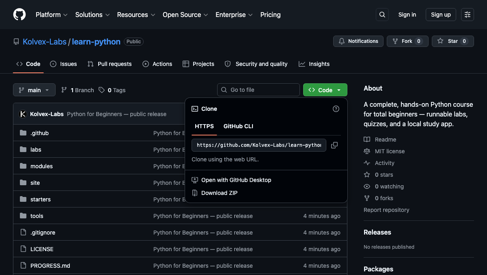
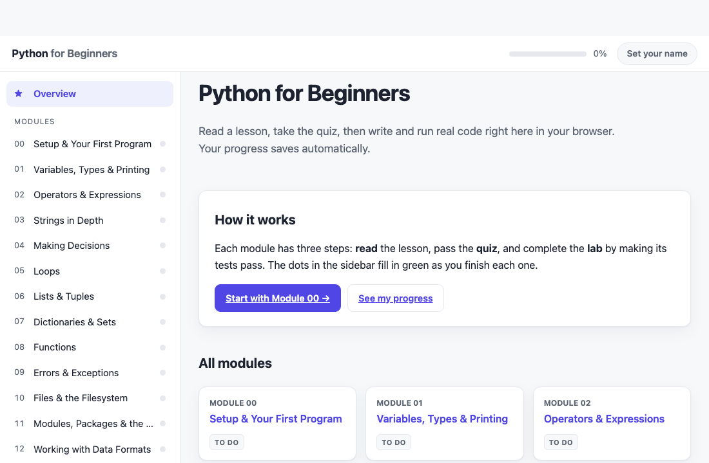

# Python for Beginners

A complete, hands-on Python course you can study at your own pace. It starts from
absolute zero (what a variable is, how to run a program) and builds up to real
automation, web/API, and data-analysis skills.

You don't need any prior programming experience. You need a computer (Mac or Windows),
about 30–60 minutes at a time, and a willingness to type the examples yourself.

---

## What's inside

- **18 modules** (`modules/`) — short, plain-language lessons. Each ends with a
  multiple-choice quiz so you can check yourself.
- **17 labs + a capstone** (`labs/`) — small Python programs you complete. Each lab
  comes with a test file that grades your work automatically. Green means you got it.
- **A tutor agent** — `python-tutor`, a Claude Code helper that quizzes you, runs your
  lab tests, gives hints (without spoiling the answer), and tracks your progress.
- **An interactive site** — read lessons, take quizzes, and write + run lab code right
  in your browser. One command, no setup beyond Python. See below.
- **A progress tracker** (`PROGRESS.md` for notes; the site tracks progress on its own).

---

## How to launch the course

You study the whole course in your web browser. There are **three one-time setup steps**,
then it's a **single command** whenever you want to study. No coding knowledge needed to
get it running — just follow along.

### Step 1 — Install Python (one time)

Python is the free program that runs the course.

- **Windows:** go to **[python.org/downloads](https://www.python.org/downloads/)**, click
  the big yellow **Download** button, open the file, and run the installer. **Important:**
  on the first screen, tick the box that says **"Add Python to PATH"** before clicking
  *Install Now*. (This one checkbox prevents the most common problem.)
- **Mac:** you may already have Python. To be sure you have a current version, download it
  from **[python.org/downloads](https://www.python.org/downloads/)** and run the installer.

### Step 2 — Get the course onto your computer (one time)

The easy way, no extra tools:

1. On this project's GitHub page, click the green **`< > Code`** button (near the top).
2. Choose **Download ZIP**.
3. Open your Downloads, and **unzip** the file: **double-click** it on Mac, or
   **right-click → Extract All** on Windows. You'll get a folder (for example `learn-python`).

*(Comfortable with git? You can instead run `git clone https://github.com/Kolvex-Labs/learn-python.git`.)*



### Step 3 — Start the course

You'll use a **terminal** — a plain window where you type one command. Don't worry, it's
just this once per session.

1. **Open the terminal:**
   - **Mac:** press **`Cmd` + `Space`**, type **Terminal**, press **Enter**.
   - **Windows:** press the **Windows key**, type **PowerShell**, press **Enter**.
2. In that window, type `cd` and a space (the letters c, d, then space), then **drag the
   course folder from Finder/Explorer onto the window** — it fills in the location for you.
   Press **Enter**.
3. Now type the start command and press **Enter**:
   ```
   python3 study.py      ← on a Mac
   python study.py       ← on Windows
   ```

The very first time, it spends about a minute setting itself up. Then **your web browser
opens to the course automatically.** Read a lesson, take the quiz, write code in the page,
and click **Save & Run** to check your work. 🎉



- **To stop:** click the terminal window and press **`Ctrl` + `C`**.
- **To study again later:** repeat Step 3 (open a terminal, `cd` to the folder, run the command).

Everything runs on your own computer — nothing is uploaded, and there's no account to
create. Your progress saves automatically as you go.

### If something doesn't work

| What you see | What to do |
|--------------|------------|
| `command not found` for `python` or `python3` | Python isn't installed, or isn't on your PATH. Redo **Step 1** — on Windows, re-run the installer and make sure **"Add Python to PATH"** is ticked. |
| The browser didn't open on its own | Look in the terminal for a line like `Open: http://127.0.0.1:8000/`. Click it, or copy-paste it into your browser. |
| `cd: no such file or directory` | The folder location was typed wrong. Use the **drag-the-folder** trick in Step 3 instead of typing the path. |
| `python` opens the Microsoft Store (Windows) | Python isn't installed yet — do **Step 1**, ticking "Add Python to PATH". |

*(Want a developer-style setup with Homebrew and a virtual environment instead? See
`SETUP.md`. Backups: your progress is always saved on your computer; if you set the course
up with git, stopping it also pushes a backup to GitHub via `./save-progress`.)*

---

## Start here

1. Follow **How to launch the course** above — that's all most people need.
2. When the site opens, begin with **Module 00**, then go in order: read the lesson,
   take the quiz, do the lab. Aim for one module per sitting.
3. Prefer working in your own code editor and terminal instead of the browser? `SETUP.md`
   has a developer-style setup, and the study loop below explains that manual flow.

---

## The study loop (repeat for each module)

```
Read the module   →   Take the quiz   →   Do the lab   →   Run the test   →   Tick PROGRESS.md
   modules/NN-*.md       (end of module)     labs/NN-*/      pytest passes        ✅
```

**How to run a lab's test** (with your virtual environment active — see SETUP.md):

```bash
cd ~/Code/python-course
pytest labs/01-variables/
```

- All green → you're done, move on.
- Red → read the failure message, fix your code in the lab's `.py` file, run again.
- Stuck? Ask the tutor agent for a hint, or peek at the lab's `*_solution.py` as a last resort.

---

## Using the tutor agent

In Claude Code, ask for the **python-tutor** agent. Good things to say:

- "Quiz me on Module 5."
- "Grade my lab 8 and tell me what's failing."
- "I'm stuck on lab 12 — give me a hint, don't show the answer."
- "What should I work on next?"

The tutor runs your tests, explains failures in plain English, and gives hints in
stages so you still get to solve it yourself.

---

## How a lab folder is laid out

```
labs/01-variables/
├── README.md            # the task: what to build
├── variables.py         # YOU edit this — it has TODOs to fill in
├── test_variables.py    # the auto-checker (don't edit this)
└── variables_solution.py# the answer key (look only if you're stuck)
```

Each lab uses its own clearly-named file (`variables.py`, `strings.py`, …) so you
always know which file you're working in.

---

## Course map

| #  | Module | You'll be able to… |
|----|--------|--------------------|
| 00 | Setup & Your First Program | Install Python, run a script, use the REPL |
| 01 | Variables, Types & Printing | Store and show values; use f-strings and input |
| 02 | Operators & Expressions | Do math and comparisons; combine conditions |
| 03 | Strings in Depth | Slice, search, and format text |
| 04 | Making Decisions | Branch with if/elif/else and match |
| 05 | Loops | Repeat work with for and while |
| 06 | Lists & Tuples | Store ordered collections of items |
| 07 | Dictionaries & Sets | Look things up by key; handle unique items |
| 08 | Functions | Package reusable logic with inputs and outputs |
| 09 | Errors & Exceptions | Read tracebacks; handle failure gracefully |
| 10 | Files & the Filesystem | Read and write files; work with paths |
| 11 | Modules, Packages & the Standard Library | Organize code; use pip and venv |
| 12 | Working with Data Formats | Read and write JSON and CSV |
| 13 | Object-Oriented Programming | Model things with classes |
| 14 | Automation Track | Script real file/folder chores |
| 15 | Web & APIs Track | Call REST APIs and parse JSON |
| 16 | Data & Analysis Track | Turn a CSV into insights |
| 17 | Capstone Project | Combine it all: API → process → report |

---

## Support this project

This course is free and open source, built for anyone who wants to learn to code.
If it helped you and you'd like to support more open-source learning projects like
this one, you can sponsor the work here:

❤️ **[Become a sponsor →](https://github.com/sponsors/Kolvex-Labs)**

Every bit helps, and it's hugely appreciated. Thank you.

---

Built for anyone who is wanting to learn code. Take your time, type everything, and let
the tests tell you when you've got it. You'll be writing real Python faster than you think.
